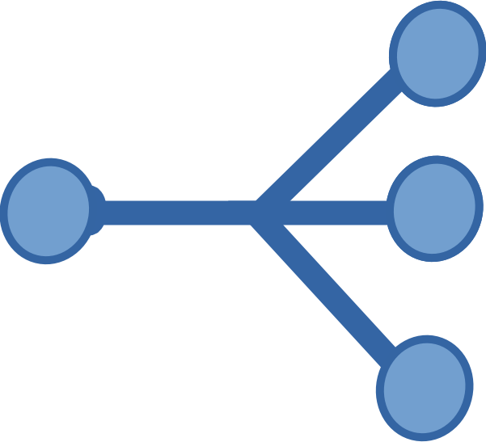
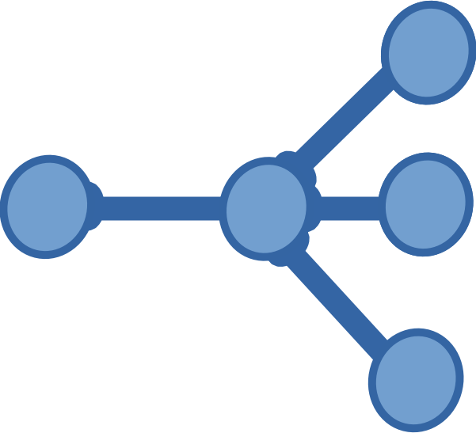
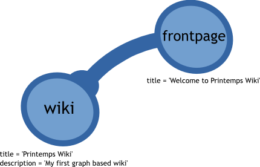
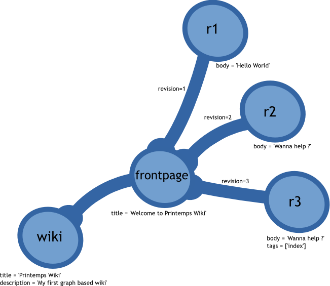

.. Printemps documentation master file, created by
   sphinx-quickstart on Fri Oct 12 14:00:16 2012.
   You can adapt this file completely to your liking, but it should at least
   contain the root `toctree` directive.

Welcome to python-blueprints's documentation!
=============================================

Installation
============

There is no binary package for now so you may have some difficulties installing 
python-blueprints on Windows and MacOS machines, but it's possible.

Follow the next ninja-cli dance::

  $> mkvirtualenv --system-site-packages coolprojectname
  $> pip install cython git+git://github.com/kivy/pyjnius.git blueprints

You will most likely need both OrientDB and Neo4j libraries if you plan to 
support them, python packages are provided for each of them::

  $> pip install neo4j_jars orientdb_jars

You are ready for some graph database awesomeness in Python.

Getting started with core API
=============================

The python-blueprints API is straightforward it's basicly the
`Blueprints <https://github.com/tinkerpop/blueprints>`_ API in Python, if you 
know `Neo4j's python-embedded <https://github.com/neo4j/python-embedded>`_ 
the API is similar but not the same.

Create a graph
--------------

Creating a graph is just matter of knowing where to store the files and the
backend you want to use, currently only `Neo4j <http://neo4j.org/>`_ and
`OrienDB <http://www.orientdb.org/index.htm>`_ are supported.

For the purpose of the tutorial, we will use ``/tmp/`` as directory storage.

Using Neo4j:

.. code-block:: python

   from printemps.core import Graph

   graph = Graph('neo4j', '/tmp/')

Getting OrientDB running is very similar:

.. code-block:: python

   from printemps.core import Graph

   graph = Graph('orientdb', 'local:/tmp/')

A Wiki model
------------

The following is exactly the same for both OrientDB and Neo4j. In order to make
easier for everybody to understand how graphs works, we will model a wiki, while
we introduce the base API of any graph databases used with ``printemps.core``.

A wiki will be a set of pages which have several revisions.

Create and modify edge and vertex
---------------------------------

To create a vertex just call ``Graph.vertex()`` method inside a transaction:

.. code-block:: python

   with graph.transaction():
      wiki = graph.vertex()

There is no ``Vertex.save()`` method nor ``Edge.save()``, the elements are
automatically persisted if the transaction succeed.

If you want to know the identifier of the wiki in the database to store it
somewhere or learn it by hearth, you can use ``Vertex.id()``, ``Edge.id()``
does the same for edges.

Both vertex and edge work like a dictionnary, you can set and get properties,
they are persisted if you do it inside a transaction, I don't know what happens
outside transactions. Let's give a name and description to our ``wiki`` vertex:

.. code-block:: python

   with graph.transaction():
       wiki['title'] = 'Printemps Wiki'
       wiki['description'] = 'My first graph based wiki'

Keys are *always* strings, values can be:

- strings
- integers
- list of strings
- list of integers

We will see later how it can be done, it's very natural for Python programmers.

Now we will create a page, a page will be vertex too:

.. code-block:: python

   with graph.transaction():
       frontpage = graph.vertex()
       frontpage['title'] = 'Welcome to Printemps Wiki'

The page needs to be linked to ``wiki`` as a *part of*, for that matter
there is a method ``Graph.edge(start, end, label)`` than can be used
like this:

.. code-block:: python

   with graph.transaction():
       partof = graph.edge(wiki, frontpage, 'part of')

An edge has three important methods, that do actually nothing but return the 
value we are interested in, but since those are not editable, you access them
through methods:

- ``Edge.start()`` returns the vertex where the edge is starting, in the case
  of ``partof`` it's ``wiki`` vertex
- ``Edge.end()`` returns the vertex where the edge is ending, in the case
  of ``partof`` it's ``frontpage`` vertex
- ``Edge.label()`` returns the label of the edge, in the case of ``partof``
  it's the string ``'part of'``

In general, every object you think of is a vertex, but some times some «objects»
are modeled as edges, those are links. An object representing a link between 
**two** objects is an edge. If the link object involves more that two edges, 
then it can be represented as an *hyperedge*.

The idea behind the *hyperedge* is that a vertex can be linked to several 
other vertex using only one special edge the hyperedge, which means the edge 
starts with one vertex, and ends with several vertex. Here is an example 
representation of an hyperedge:

This can be modeled in a graph using only vertices and simple edges with 
an intermediate vertex which serves as a hub for serveral edges that will 
link to the end vertices of the hyperedge. Here is the pattern illustrated:

*Hyperedges* are not part of popular graphdbs as is, so you have to use
the intermediate vertex pattern. 

To sum up, link objects with more that two objects involved in the link are 
the exception among link objects and are represented as vertex.

Navigation
----------

Stay away with your motors, sails and emergency fire lighters, it's just plain
Python even though you can do it in boat too, but this is not my issue at the
present moment.

Before advancing any further, let's sum up, we have a graph with two vertices,
and one edge, it can be represented as follow:

Because we like the wiki so much we know its identifier by hearth and stored 
it in a variable named ``wiki_identifier``, we can retrieve the ``wiki`` vertex 
like so:

.. code-block:: python

   wiki = graph.get_vertex(wiki_identifier)

Vertices have two kinds of edges:

- ``Vertex.incomings()``: a generator yielding edges that **end** at this vertex,
  currently there is none on wiki
- ``Vertex.outgoings()``: a generator yielding edges that **start** at this vertex,
  currently there is only one.

To retrieve the frontpage we can use ``next`` function of ``wiki.outgoings()`` 
to rertrieve the first and only edge as first *hop* and navigate to the index 
using ``Edge.end()`` as second *hop*:

.. code-block:: python

   link = next(wiki.outgoings())
   frontpage = link.end()

We got back our ``frontpage`` vertex back, Ulysse himself wouldn't believe it,
it's not the same object though.

More vertices and more edges
----------------------------

What we have right now is only a wiki with a page and its title, but there is
no content and no revisions. For that matter we will use more edges and more
vertex. Before the actual code which re-use all the above we will have a look
at what we are going to build:

This is one of the normalized graph that can be used to represent the wiki,
every graph structure that solve this problem has its strengths, this happens,
I think, to be the simplest.

First let's create a function that create a revision for a given page given a
body text, if you followed the whole tutorial it should be easy to understand,
and even if you happen to be here by mistake, I think it semantically expressive
enough to be understood by any Python programmer:

.. code-block:: python

   def create_revision(graph, page, body):
       max_revision = 0
       for link in page.outgoings()
           max_revision = max(link['revision'], max_revision)
       new_revision = max_revision + 1
       with graph.transaction():
            # create the vertex first
            revision = graph.vertex()
            revision['body'] = body
            # link the edge and annotate it
            link = graph.edge(page, revision, 'revised as')
            link['revision'] = new_revision

``create_revision`` does the following:

#. Look for the highest revision in edges linked to ``page``
#. Increment the revision number for the new page
#. Create the new revision
#. Link it to ``page`` with the proper revision property on the link vertex

A basic wiki would only need to fetch the last revision that's what we do
in the following ``fetch_last_revision`` function:

.. code-block:: python

   def fetch_last_revision(graph, page):
       max_revision_num = 0
       max_revision = None
       links = dict()  # store revision numbers with their links
       for link in page.outgoings()
           new_revision = max(link['revision'], max_revision)
           if new_revision != max_revision:
                max_revision = link.end()
       return max_revision  # if it returns None, the page is empty

That is all! Creating a page is very similar to this, so I won't repeat the same
code... Oh! I almost forgot about the list of strings as property, the following
function will add the tags passed as arguments which must be a list of strings,
as tags property of the last revision:

.. code-block:: python

   def fetch_last_revision(graph, page, tags):
       max_revision_num = 0
       max_revision = None
       links = dict()  # store revision numbers with their links
       for link in page.outgoings()
           new_revision = max(link['revision'], max_revision)
           if new_revision != max_revision:
                max_revision = link.end()
       max_revision['tags'] = tags  # free as in freewill ;)

Well there is much code that can be factored, but the basics like I said at 
the beggning are pretty straightforward, getting links working between pages
is left as an exercices to the reader.

Index
-----

GraphDBs have index, to create an index of vertex use the following code:

.. code-block:: python

  pages = graph.index.create('pages', graph.VERTEX)

To create an index of edges do this:

.. code-block:: python

  revisions = graph.index.create('revisions', graph.EDGE)

Then you can put vertex in an index using ``put(key, value, element)``:

.. code-block:: python

  pages.put('page', 'page', page)

``key`` and ``value`` parameters are not really interesting in the above
example but an index can be that simple. You can use ``key`` and ``value`` 
to have a fine-grained index of related elements, for instances, the 
following snipped builds an index for revisions, properly separating minor, 
major revisions and sorting them by date of revisions::

.. code-block:: python

  revisions.put('all', 'today', r2)
  revisions.put('all', 'yesterday', r1)
  revisions.put('all', 'before', r0)
  revisions.put('minor', 'today', r2)
  revisions.put('major', 'yesterday', r1)
  revisions.put('all', 'before', r0)

You can use ``Graph.index.get(name)`` to retrieve an index:

.. code-block:: python

  index = graph.index.get('pages')

To retrieve an index content, use ``Index.get``, like this:

.. code-block:: python

  index = index.get('pages', 'pages')
  first_page = next(index)

That's almost all the index API, for more please refer to the API documentation.

End
---

When you finished working with the database don't forget to call
``Graph.close()``.

More
----

If you still struggle with the API here is it with more comments:

- ``from blueprints import Graph``

 - ``Graph(name, path)`` remember that name is lower case of the databases names
   and the path for OrientDB is prepended with ``local:``.
 - ``Graph.transaction()`` is a contextmanager, thus used with ``with`` statement
   that starts a transaction, elements are automatically saved and you **must**
   always do mutating operations in transaction.
 - ``Graph.vertex()`` create a vertex in a transaction.
 - ``Graph.edge(start, end, label)`` create an edge in a transaction starting at
   ``start`` vertex, ending at ``end`` vertex with ``label`` as label. The 
   tutorial doesn't say much about labels, so I add here that it's a way to know
   which edge is which when they are several edges starting and ending at the 
   same vertices.
 - ``Graph.get_vertex(id)`` and ``Graph.get_edge(id)`` do what you think they 
   do, generaly you don't need to *know* beforehand more than one vertex 
   identifier which might depend on the backend.
 - ``Graph.close()`` clean up your database after you finished work ;)
 - ``Graph.edges()`` and ``Graph.vertices()`` were not presented because they IMO
   should not be used outside debug in an application where speed matters.

- An element is a vertex or an edge, they both are usable as dict to get and set values
  but can only be mutated in a transaction. Every element can be deleted 
  with ``delete()`` method in a transaction.
- ``Vertex`` you don't import Vertex class, you get it from ``Graph.vertex()``
  or ``graph.get_vertex(id)`` or hoping through ``Edge.end()`` or 
  ``Edge.starts``.

 - ``Vertex.outgoings()`` is a generator over the edges that are starting from
   the current vertex, each edge retrieved implied a *hop*.
 - ``Vertex.incomings()`` is a generator over the edges that are ending in the 
   current vertex, each edge retrieved implied a *hop*.
- ``Edge`` similarly are not imported, they are created with 
  ``Graph.edge(start, end, label)`` retrieved with ``Graph.get_vertice(id)``
  and via iteration of ``Vertex.outgoings()`` and ``Vertex.incomings()`` 
  generators.

 - ``Vertex.start()`` retrieve starting vertex via a *hop*
 - ``Vertex.end()`` retrieve ending vertex via a *hop*
 - ``Vertex.label()`` retrieve the label associated with the edge.

- Similarly you don't import the ``Index`` class, but create one using
  ``Graph.index.create(name, ELEMENT)`` where ``ELEMENT`` should be one
  of ``Graph.EDGE`` or ``Graph.VERTEX`` or retrieve the index
  by its name using ``Graph.index.get(name)``.

 - ``Index.put(key, value, element`` put ``element`` in the ``key``, 
 ``value`` namespace.
 - ``Index.get(key, vallue)`` to retrieve the index content, this is a
   generator over the index content.

*hops* are a metric used to compute the complexity of a query.
